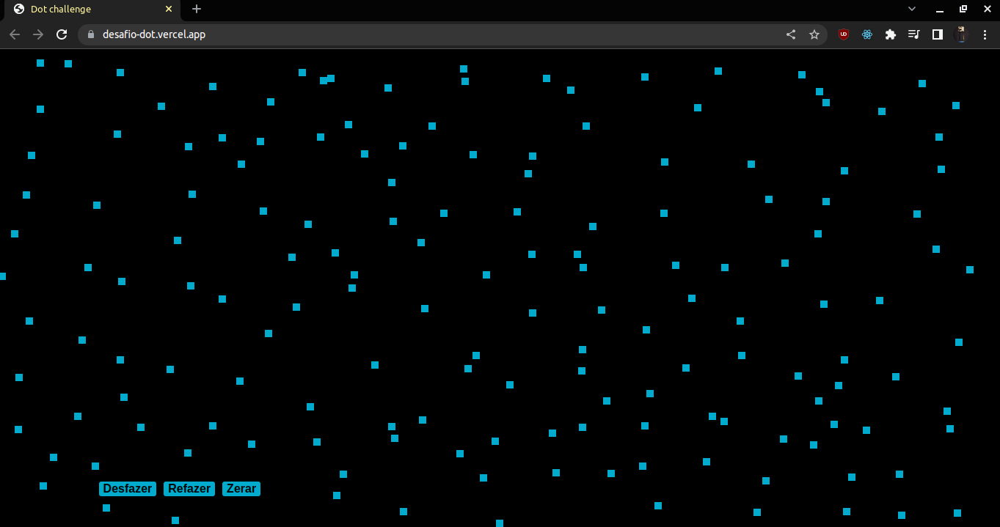

Projeto Web desenvolvido: RESOLVENDO DESAFIO de entrevista REACT.JS.

### Descrição:

- [x] Listagem de pontos na tela ao clicar;
- [x] Desfazer ultimo ponto;
- [x] Refazer ultimo ponto desfeito;
- [x] Remover todos os pontos;

## Tecnologias utilizadas: 🚀
- ReactJs
- JavaScript
- HTML
- CSS

### Desktop (screenshot):

### Mobile (screenshot):

### Dê uma olhada como o projeto ficou!

https://al-money.vercel.app/

 
